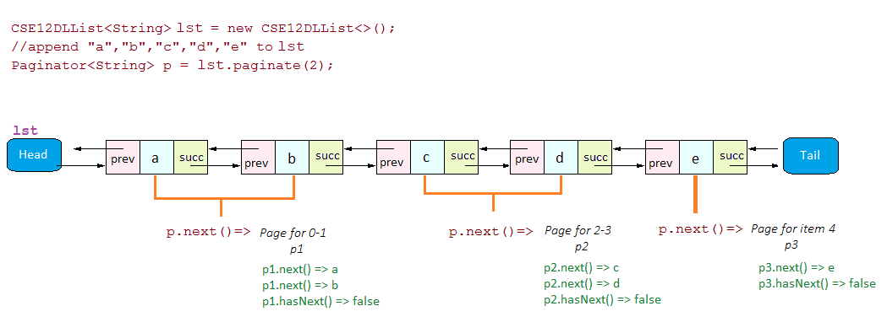
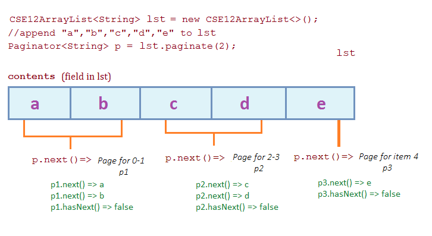

<h1>{{ page.title }}</h1>

This assignment will teach you about the structure of lists by having you
implement an interesting way to iterate over them. It will also teach you how
to separately design individual components that make up a larger
implementation.

A warning: The time it took you to complete PA1 is probably **not** a good
predictor of how long PA2 will take. This is more involved. Start early, start
often.

## Pagination

A common pattern in user interfaces is the _pagination_ of results – that is,
splitting a list of results across pages. Shopping sites do it at the bottom of
their search results, for example:


The numbers 1 2 3 ... 20 refer to _pages_ of results, with page-by page
traversal via next and previous actions.

## Problem Structure

This project will have two kinds of iterators that you implement – a
`Paginator`, which iterates back and forth between pages, and a `Page`, which
iterates through the items on a page. You will implement them for two different
implementations of list – doubly-linked lists and array lists. In total, you'll
implement those four classes along with tests for them. You'll also implement a
few list methods that we left out for you to practice with these structures.

The provided classes `CSE12DLList` (`DL` for “doubly-linked”) and
`CSE12ArrayList` contain the list implementations whose contents will be
paginated. Each of these classes implements a `paginate` method that initially
returns `null`. You can fill this in with a call to the appropriate paginator's
constructor once you decide on a design for it.

## List Implementations

We've provided you with mostly complete implementations of a simple array list
and a simple doubly-linked lists. You will implement three methods (stubbed out
with TODO comments): `findFirst`, `removeFirst`, and `paginate`. Note that
you'll be implementing each of these methods twice – once for array lists and
once for doubly-linked lists.

There is a file called `TestLists.java` that you can use to write tests for
these methods. Like in PA1 for Bag implementations, it is parameterized to run
all the tests for both list implementations, providing a `makeList` method that
you can use to instantiate new lists.

Implementing the first two of these—`findFirst` and `removeFirst`—is a good
place to start, because it will get you familiar with the existing list data
structures that are in place. The description of these methods is in the
interface description in `CSE12List.java`.

## Paginator

You will implement two subclasses of `Paginator<E>`, one for each type of
lists. The `Paginator<E>` abstract class implements `ListIterator<Page<E>>`.
You can read the official Java documentation for <a
href="https://docs.oracle.com/javase/7/docs/api/java/util/ListIterator.html">ListIterator
here</a>. You will _not_ implement the `add`, `remove`, and `set` methods (the
ones listed as optional) – we've provided `Paginator` as an abstract class with
default implementations of these three methods that simply throw exceptions;
you don't need to alter these at all.

You have a lot of choice in how you implement `Paginator`; the starter code
begins with the class totally blank, and you will choose fields, a constructor,
and how to implement all the required methods from `ListIterator`. For
reference, there are 6 methods to implement – `hasNext()`, `next()`,
`hasPrevious()`, `previous()`, `nextIndex()`, and `previousIndex()`.

Some examples are below.

## Page

Each time the `next()` or `previous()` methods are called on a `Paginator`, it
returns a `Page`. The type `Page<E>` is defined in `Page.java` to be equivalent
to `Iterator<E>`; the documentation for <a
href="https://docs.oracle.com/javase/7/docs/api/java/util/Iterator.html">Iterator
is here</a>. You will write two
classes that implement `Page`, again one for the linked list and one for array
lists. You won't implement the `remove` method (listed as optional).

A `Page` implementation should have `hasNext` and `next` method. The `next()`
method should return, sequentially, the items in the subset for that page.

## An example

The example below illustrates the core behavior of both kinds of iterators.

```
// Create and populate a list (this should work for either kind of list)
CSE12List<String> lst = makeList();
lst.append("a");
lst.append("b");
lst.append("c");
lst.append("d");
lst.append("e");

// We will paginate the list with 2 items per page
Paginator<String> p = lst.paginate(2);

// Check a few pages for their content...
Page<String> p1 = p.next();
assertEquals("a", p1.next());
assertEquals("b", p1.next());

Page<String> p2 = p.next();
assertEquals("c", p2.next());
assertEquals("d", p2.next());

// Make sure the last page, with less than perPage elements,
// only has the remaining elements
Page<String> p3 = p.next();
assertEquals("e", p3.next());
assertFalse(p3.hasNext());

// At this point, we should not be able to go forward, only backward
assertFalse(p.hasNext());
assertTrue(p.hasPrevious());

// Going backward first returns the most recent item returned by next
// (This matches the specification of ListIterator -- repeated calls to previous
// and next should return the same element)
Page<String> p3Again = p.previous();
Page<String> p2Again = p.previous();

// p2 (the c, d Page from above) and p3 are still at the end.
// The returned Page is a fresh copy that can restart from the beginning
assertFalse(p2.hasNext());
assertFalse(p3.hasNext());

assertEquals("e", p3Again.next());
assertFalse(p3Again.hasNext());

assertEquals("c", p2Again.next());
assertEquals("d", p2Again.next());

assertTrue(p.hasNext());
```
Here are diagrams that should give you an idea of how the above data is
structured.<br><br>
Using the Doubly Linked List implementation
<br>
Using the Array implementation
<br>

## Testing

You are responsible for testing your implementation. You should test `Page` and
`Paginator` independently and thoroughly to ensure that they behave as you
expect. You can write all of your tests in the `TestLists.java` test class that
we set up for you.

In the grader, your tests will be evaluated by running them against several bad
implementations, which we will _not_ show you the source code for. You will be
able to see feedback on this via the autograder.

## Checklist

You should make sure to do all of the following:

- Implement `removeFirst` and `findFirst` on `CSE12DLList`
- Test `removeFirst` and `findFirst` on `CSE12DLList`
- Implement `removeFirst` and `findFirst` on `CSE12ArrayList`
- Test `removeFirst` and `findFirst` on `CSE12ArrayList`
- Implement `ALPage`, test thoroughly
- Implement `DLPage`, test thoroughly
- Implement `DLPaginator` (throw `UnsupportedOperationException` for `add`,
  `remove`, `set`), test thoroughly
- Implement `ALPaginator` (throw `UnsupportedOperationException` for `add`,
  `remove`, `set`), test thoroughly

## Things to Do, Not Do, and Assume

There are some things you should do:

- Read the documentation for `ListIterator` and `Iterator`
- Tackle the assignment in this order:
    - First, write the `removeFirst` and `findFirst` methods in the two list
      classes, and test them to make sure they work. This will get you familiar
      with the list implementations' structure.
    - Second, _on paper, in a drawing program, or in plain text, not in code_,
      come up with a design for the fields and constructors for one pair of
      `Page` and `Paginator` classes. Draw pictures and come up with examples
      of simple situations, like two pages of two elements each, and think
      about what would be stored in the fields of the two classes after
      different uses of `next()`, and what the layout of the list will look
      like when the call to `paginate()` is made. The example above can guide
      you, but you might want to start with something even simpler.
    - Third, translate your idea for the `Page` you have in mind into code.
      Construct any `Node`s or arrays you need to construct it in a test, and
      then implement the `next()` and `hasNext()` methods and check that they
      work as you expect. Make sure you get a simple version working before you
      go on! You might come back and edit this design, but you should make sure
      you know what your `Page`s do.
    - Fourth, do the same for the `Paginator` class you have in mind. At this
      point, you'll have a constructor for the `Paginator`, and can fill in the
      `paginate` method of the corresponding list class with a use of the
      constructor. Start testing the `Paginator` by creating sample lists that
      correspond to your examples from earlier, and then filling and and using
      the various methods required by `ListIterator`.
    - Repeat the process for the other list implementation, or, at any time
      pause and try the other.

There are a few things you should explicitly not do on this assignment.

- Outside of tests, you should never call the constructors for `Node` or the
  list classes (inside tests, it's very much encouraged). The `Paginator` and
  the `Page` implementations shouldn't be constructing new nodes or lists, only
  using references to existing ones.
- The `Paginator` classes should _not_ get references to list objects. They can
  get references to contents, like nodes or arrays, and be passed information
  when constructed, but they should not receive a reference to the list itself.
- The `Paginator` and `Page` classes should _not_ make any changes to the
  contents of the list (if we were implementing the optional `add`, `set`, and
  `remove` methods on `ListIterator`, we would, but the methods we are
  implementing should not).
- Don't change the list classes beyond the bodies of the `removeFirst`,
  `findFirst`, and `paginate`. In particular, don't change access modifiers
  like `private`; instead, figure out how to pass that information to where it
  needs to go.

There are also a few things you can _assume_ (and correspondingly don't need to
bother testing).

- The `perPage` parameter will always be greater than 0
- The various methods that manipulate list elements (e.g. `append`, `prepend`,
  `removeFirst`, `findFirst`, and so on), will never be passed `null`.
- You can assume that the list that created an iterator is not changed between
  calls to the iterator's methods – that is, if you create an iterator, then
  add an element, the iterator doesn't have to carefully take into account that
  addition before calling `next()`. This is a real-world assumption, not simply
  done to simplify the assignment. Real-world code turns this case into an
  error: you can look up the documentation on “fail-fast iterators” and <a
  href="https://docs.oracle.com/javase/7/docs/api/java/util/ConcurrentModificationException.html">`ConcurrentModificationException`</a>
  to see more about why.

## Style

Use automatic formatting options to handle whitespace and syntactic choices
about braces.

Strive to make your code as readable as possible without the use of excessive
comments. Write a javadoc header comment on each method you write. Focus the
header comment on any interesting effects the method has (e.g. changing an
index field, manipulating references to `Node`s, etc).

## Submission and Grading

Get started right away. We'll make an autograder available by Saturday, Jan 20
via Gradescope, which will show the grading breakdown.


