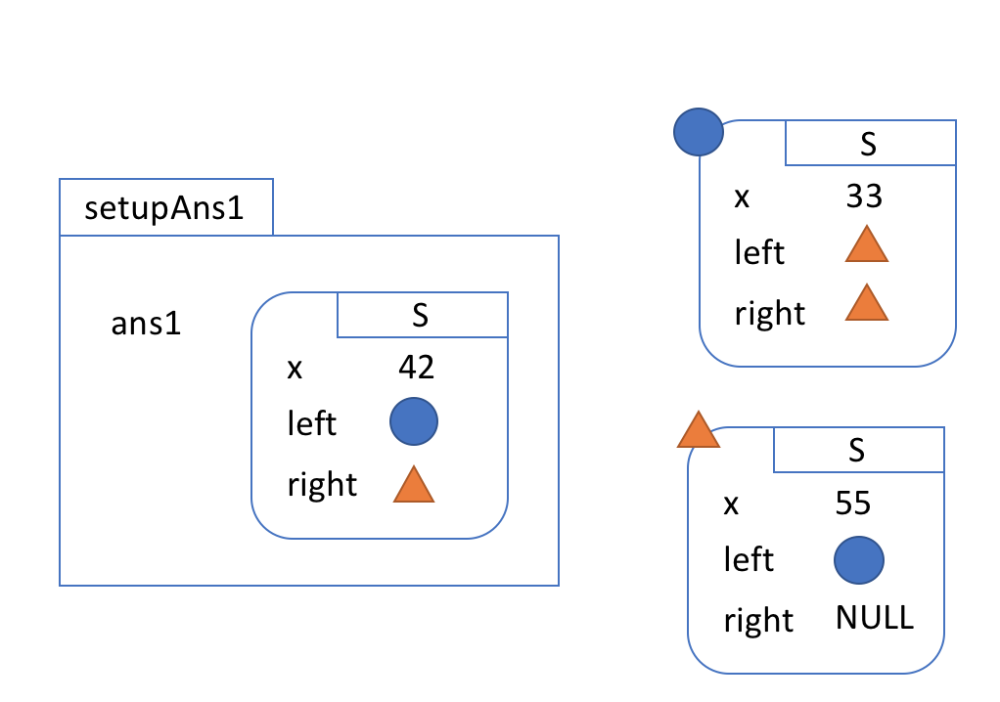
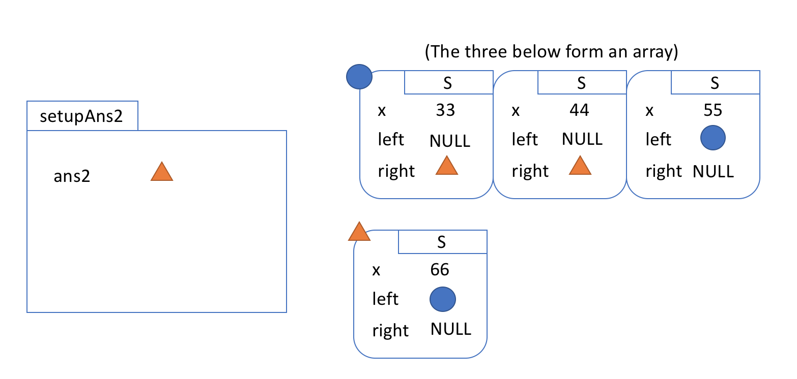

<h1>{{ page.title }}</h1>

In this assignment you'll get some practice with C, and you'll implement and
test a min-heap in C, paying careful attention to memory allocation.

Note that this assignment is _entirely autograded_, and there will be _no
regrades_. We'll include all the information about your grade with the
autograder, so you'll know your grade before submission.

## Two Practice Exercises

First, you're going to do two warm-up exercises. These are be due by Monday
midnight and worth 10% of your grade.

- `insert.c`: This file contains an implementation of inserting into an array
  that appears to work, but has some memory errors. You will use `valgrind` to
  detect and fix the memory errors. You can run this example with `make insert`, which will run the necessary valgrind command. You'll hand in the corresponding fixed C file.
- `struct_of_picture.c`: In this file, you will write initialization code to
  construct data that matches the pictures shown below. You'll hand in a C file that makes the `main` method print both `"You got ans1!"` and `"You got ans2!"`





## The Heap Interface In C

Unlike Java, C doesn't have language support for a feature called an
“interface.” That said, the concept of a collection of functions that implement
a particular feature independent of the underlying representation is still a
reasonable one to consider. For this heap implementation, we'll take a
collection of function headers as our interface:

```
Heap* makeHeap(int capacity);
void add(Heap* heap, int priority, char* value);
char* removeMin(Heap* heap);
char* peek(Heap* heap);
int size(Heap* heap);
void cleanupHeap(Heap* heap);
```

In addition, we've defined a few structs for you:

```
struct Pair {
  int key;
  char* value;
};
typedef struct Pair Pair;

struct Heap {
  int capacity;
  int size;
  Pair* elements;
};
typedef struct Heap Heap;
```

In `heap.c`, you will write implementations of these functions. Your
implementation will be a **min heap** (the mapping with the lowest key will be
on top). Some notes on the required algorithms are at

- [Wed, Feb 14th lecture](https://ucsd-cse12-w17.github.io/lectures/02-14-wed-b/notes.html)
- [Fri, Feb 16th lecture](https://ucsd-cse12-w17.github.io/lectures/02-16-fri-b/notes.html)

Descriptions of each function are:

- `makeHeap`: Should return a pointer to a newly allocated `Heap` with the
  given `capacity`, a `size` of `0`, and an `elements` array allocated with the
  given capacity.
- `add`: Should add a new pair mapping the given `priority` as a key to the
  given value `value`. This should work by inserting `add` at the end of the
  storage array (`elements`) and bubbling up. Should run in `O(lg(size))` time,
  except when resizing. If the size is equal to the capacity, this should take
  `O(size)` time, and expand the capacity by allocating a new array of twice
  the current capacity and copying old elements over before performing the
  insertion.
- `removeMin`: Should return the value stored at the top of the heap (the one
  with the lowest priority). That element should then be removed from the heap,
  and the heap should be restored to the correct shape by moving the last
  element to the top and bubbling down. When performing bubble down, prefer
  swapping with the **left** child if both children have the same priority.
  If the heap is empty, return `NULL`. Should run in `O(lg(size))` time.
- `peek`: Should return the value stored at the top of the heap (the one with
  the lowest priority) and make no changes to the heap. If the heap is empty,
  should return `NULL`. Should run in constant time.
- `size`: Should return the number of elements in the heap (not the capacity),
  and run in constant time.
- `cleanupHeap`: Should use `free` to reclaim the memory used by the given Heap
  pointer, including its `elements` array.


## Testing

You can write tests in `test_heap.c`, where there are some examples given of
using arithmetic and checking numeric equality, and checking equality between
strings. You should write tests that create heaps, add and remove items, and
check that the operations work as expected. The two relevant functions for
writing assertions are `CuAssertEquals

## Grading

An autograder for the heaps portion will be posted on Saturday, March 10.

The practice problems and writeup quiz are due by Monday midnight (March 12).
The entire assignment is due by Wednesday midnight (March 14).

- 10%: Practice problems
- 3%: A PA writeup quiz
- 27%: Quality of testing
- 70%: Implementation correctness

